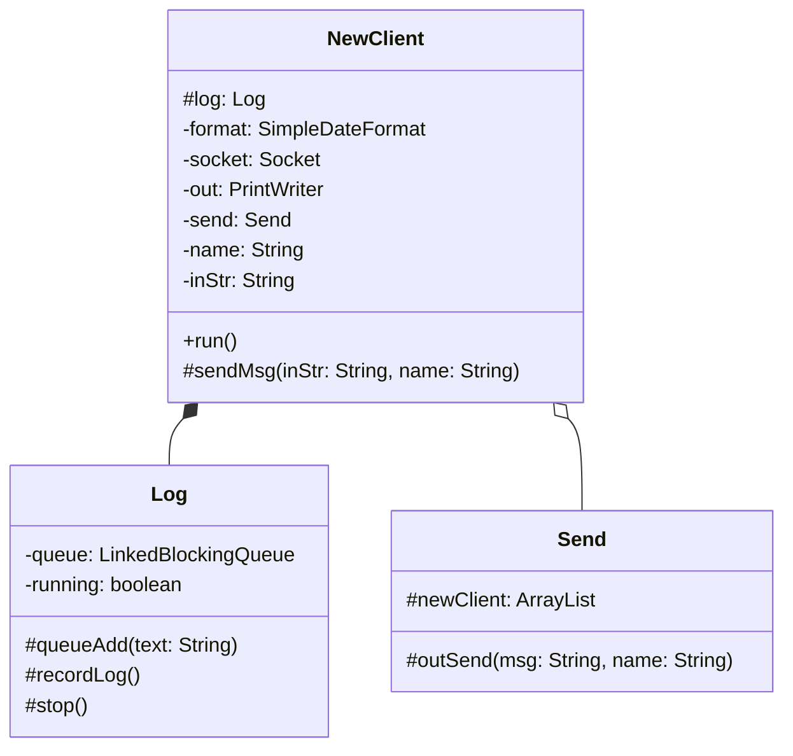

 # сервер для онлаин чата 

---
### програма состоит из 4-х класссов
1. класс (main)

    
    создаём сокет и в цикле подключаем новых клиентов в новом потоке, 
    одновременно добавляя в лист клиентов
2. класс (NewClient) 
    

    в нём происходит авторизация клиента и прописан протокол обмена сообщениями
    получаем сообщения клиента и рассылаем всем участникам чатика
    и отправляем в очередь для логирования
3. класс (Log) 

    запись всех сообщений в file.log в отдельном потоке
4. класс (Send) 

    содержит лист с клиентами и метод отправки сообщения всем клиентам outSend()

### протокол обмена сообщениями:
    обязательно ввести имя при подключении не более 20 символов,
    длина сообщения не более 100 символов.

### блок схема

